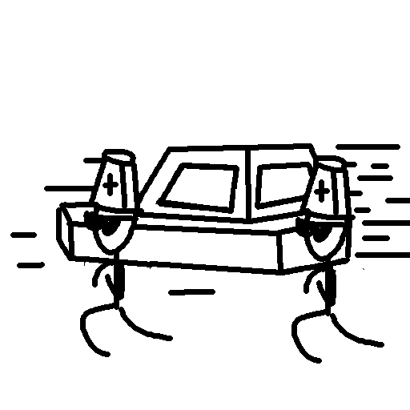

<div align="center">

## Hearse

[](https://github.com/NaturalCodeClub/Hearse/actions)
[](LICENSE)

<h5>Hearse is a drop-in replacement for <a href="https://github.com/PurpurMC/Purpur">Purpur</a> servers designed for fix some bugs and customize, and performance built on top of <a href="https://github.com/pufferfish-gg/Purpur">Purpur</a>.</h5>
<h8>Logo created by <a href="https://github.com/7777777-4547">7777777_4547</a></h8>
</div>

## Features
- Fork of [Purpur](https://github.com/PurpurMC/Purpur) for better performance.
- Async entity travel
- Async entity AI
- Some fixes

## Contact

- 📫 Telegram: `@M2ke4U` | QQ: `2506442080`

## Downloads

Downloads can be obtained in the [Actions](https://github.com/NaturalCodeClub/Hearse/actions) or [Releases](https://github.com/NaturalCodeClub/Hearse/releases)


## Building

Building a Paperclip JAR for distribution:

```bash
./gradlew applyPatches && ./gradlew createReobfPaperclipJar
```


## License
[](LICENSE)

All patches are licensed under the MIT license, unless otherwise noted in the patch headers.

See [PaperMC/Paper](https://github.com/PaperMC/Paper), and [PaperMC/Paperweight](https://github.com/PaperMC/paperweight) for the license of material used by this project.

Yes, this also includes all API provided by Paper, Spigot, and Bukkit.


Credits:
-------------
- [Purpur](https://github.com/PurpurMC/Purpur)
- [KeYi](https://github.com/KeYiMC/KeYi)
- [Akarin](https://github.com/Akarin-project/Akarin)

## Attention
This is just a joke, do not use it in a production environment, even though it has stabilized
